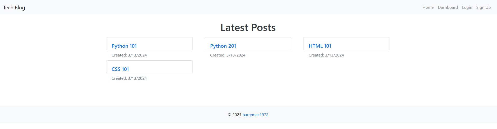

# Tech Blog

## Description

The Tech Blog CMS is a specialized platform designed for developers aiming to publish articles, blog posts, and share their expertise on various technical topics. Built around the MVC model, this system utilizes Handlebars.js for templating, Sequelize as the ORM, and incorporating the express-session npm package for authentication.

Note:  CSS is minimal.  May dive deeper in future.  Time is of the essence...

## Table of Contents
- [Installation](#installation)
- [Usage](#usage)
- [License](#license)
- [Contributing](#contributing)
- [Tests](#tests)
- [Questions](#questions)
- [Screenshots](#screenshots)
- [Demonstration Video](#video)
- [GitHub Link](#github-link)

## Installation
1. "**Node.js**" must be installed on local machine.
2. Once in your project folder please type "**npm i -y**" for all dependencies.

## Usage
Clone the repository to your local machine.
git clone https://github.com/harrymac1972/tech_blog.git
Navigate to the project directory.
cd tech-blog
Install the required dependencies.
npm install

## License
This application is licensed by: [MIT](https://opensource.org/licenses/MIT)

## Contributing
You may 'fork' the project in the github repository.

## Tests
n/a

## Questions
If you have any questions, please contact:
-- (https://github.com/harrymac1972)
-- harrymac1972@gmail.com.

## Screenshots

## Demonstration Video
n/a

## GitHub Link
<a href="https://github.com/harrymac1972/tech_blog">Tech Blog on Github</a>

## Heroku Link
<a href="https://pure-meadow-25444-f19e4991662f.herokuapp.com/">Tech Blog on Heroku</a>